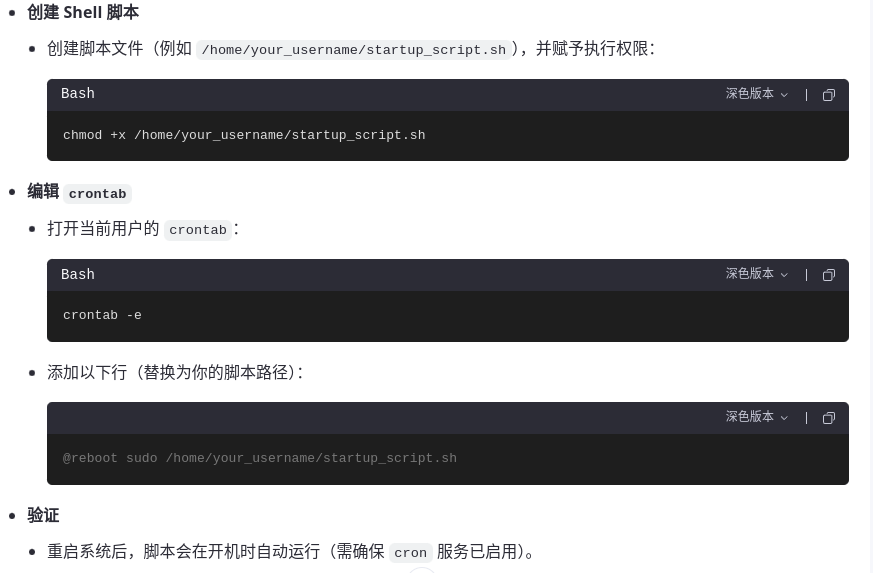

# 自研星仪1.0代码仓库
使用tauri + rust开发前后端代码

## Tauri + Vanilla

This template should help get you started developing with Tauri in vanilla HTML, CSS and Javascript.

## Recommended IDE Setup

- [VS Code](https://code.visualstudio.com/) + [Tauri](https://marketplace.visualstudio.com/items?itemName=tauri-apps.tauri-vscode) + [rust-analyzer](https://marketplace.visualstudio.com/items?itemName=rust-lang.rust-analyzer)

## 设置开机自动执行can模块配置脚本流程

## 取消开机锁屏密码
把文件lightdm.conf 放到/etc/lightdm/目录下

## Tauri环境配置说明
https://github.com/crescware/moment-digest/pull/2